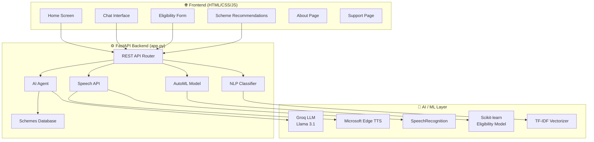
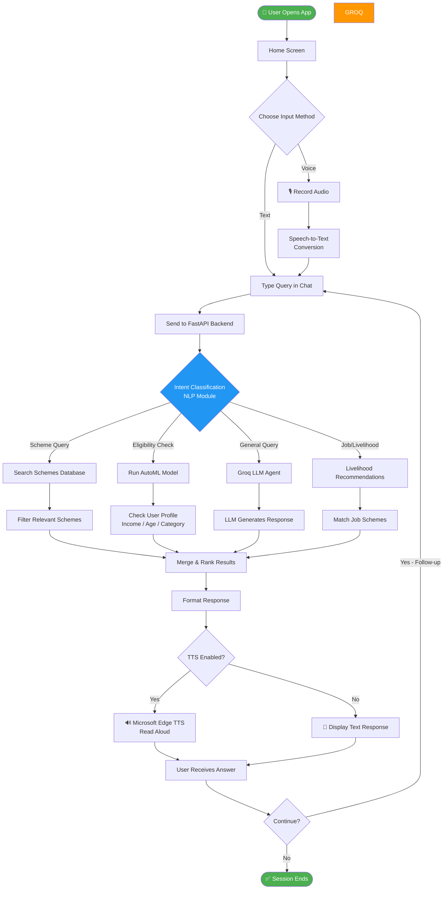
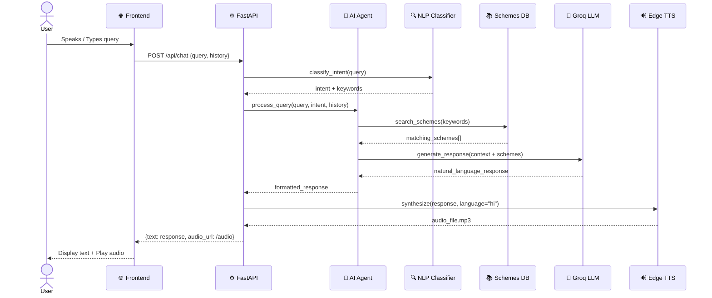
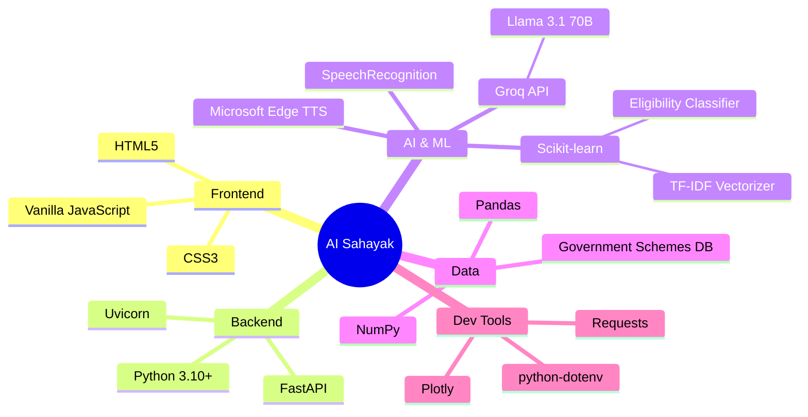
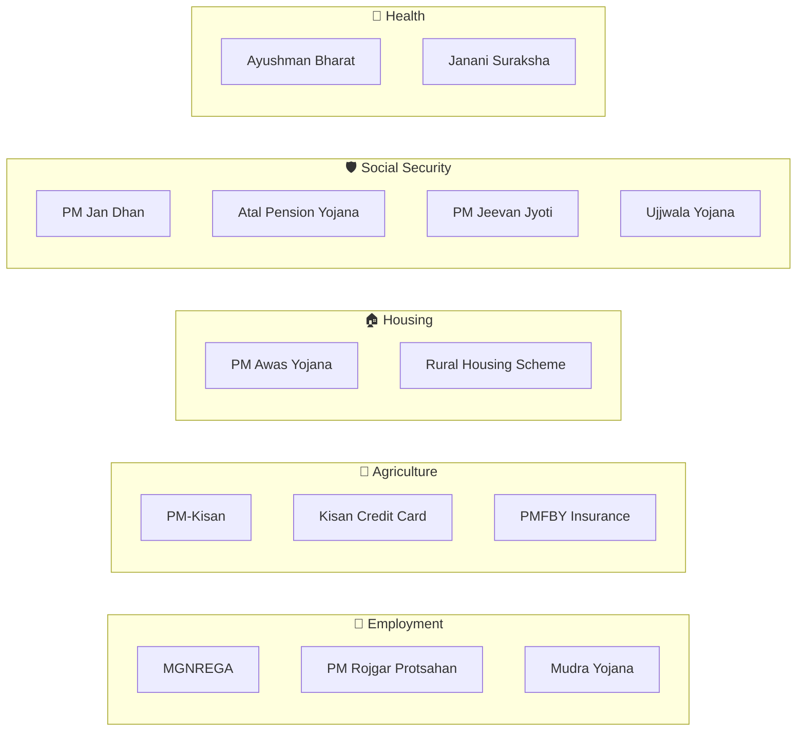

<div align="center">

# 🌾 AI Sahayak (SabbiAI)
### *AI-Powered Livelihood Assistant for Rural India*

[](https://python.org)
[](https://fastapi.tiangolo.com)
[](https://groq.com)
[](LICENSE)
[](https://github.com/Sabina-Sheoran)

---

> **AI Sahayak** is a multilingual, voice-enabled AI assistant designed to help rural Indian citizens discover and apply for government welfare schemes, job opportunities, and livelihood support — in their own language.

</div>

---

## 📋 Table of Contents

- [Overview](#-overview)
- [Features](#-features)
- [System Architecture](#-system-architecture)
- [Application Flowchart](#-application-flowchart)
- [Data Flow Diagram](#-data-flow-diagram)
- [Module Structure](#-module-structure)
- [Tech Stack](#-tech-stack)
- [Installation & Setup](#-installation--setup)
- [API Endpoints](#-api-endpoints)
- [Screenshots](#-screenshots)
- [Future Roadmap](#-future-roadmap)
- [Credits](#-credits)

---

## 🌟 Overview

Rural India faces a massive **information gap** — millions of eligible citizens miss out on government welfare schemes simply because they don't know about them or can't navigate complex forms. **AI Sahayak** bridges this gap by:

- 🗣️ **Speaking the local language** — multilingual voice input/output (Hindi, English, and regional dialects)
- 🤖 **Explaining government schemes** in plain, simple terms via an AI agent
- 📋 **Checking eligibility** automatically based on user profile
- 🔍 **Recommending schemes** tailored to the user's location, income, occupation, and family situation
- 📢 **Reading aloud** — accessible even for low-literacy users via Text-to-Speech

---

## ✨ Features

| Feature | Description |
|---|---|
| 🎙️ **Voice Input** | Speak your query in Hindi/English via microphone |
| 🔊 **Text-to-Speech** | Responses read aloud using Microsoft Edge TTS |
| 🤖 **AI Agent** | Groq-powered LLM that understands context and follows up |
| 📚 **Schemes Database** | 20+ Indian government schemes (MGNREGA, PM-Kisan, etc.) |
| 🏷️ **NLP Classifier** | Keyword-based intent classification for scheme matching |
| 🧠 **AutoML Eligibility** | ML model to predict eligibility based on user profile |
| 🌐 **Web UI** | Clean HTML/CSS frontend with multiple pages |
| 📡 **REST API** | FastAPI backend with full API documentation |
| 💬 **Conversation History** | Maintains context across multiple turns |

---

## 🏗️ System Architecture



---

## 🔄 Application Flowchart



---

## 📊 Data Flow Diagram



---

## 📁 Module Structure

```
AI Sahayak/
│
├── 📄 app.py                     # FastAPI entry point & API routes
├── 📄 setup_datasets.py          # Dataset preparation & model training
├── 📄 requirements.txt           # Python dependencies
├── 📄 .env.example               # Environment variable template
│
├── 🗂️ backend/
│   ├── agent.py                  # AI Agent — Groq LLM integration & conversation
│   ├── schemes_db.py             # Government schemes knowledge base (20+ schemes)
│   ├── nlp_classifier.py         # Intent detection via TF-IDF + keywords
│   ├── automl_model.py           # ML eligibility predictor (scikit-learn)
│   ├── speech_api.py             # TTS (Edge TTS) + STT (SpeechRecognition)
│   └── __init__.py
│
├── 🗂️ UI/
│   ├── ai_sahayak_home_screen/   # Landing page
│   ├── gramin_clarity/           # Chat interface (main interaction)
│   ├── check_eligibility_form/   # Eligibility form & results
│   ├── scheme_recommendations/   # Filtered scheme cards
│   ├── about/                    # About the project
│   ├── support/                  # Contact & help
│   ├── assets/                   # Images, icons
│   └── styles/                   # Shared CSS
│
├── 🗂️ models/                    # Trained ML model files (.pkl)
├── 🗂️ data/                      # Datasets for training
└── 🗂️ temp_audio/                # Temporary TTS audio files
```

---

## 🛠️ Tech Stack



| Layer | Technology | Purpose |
|---|---|---|
| **Frontend** | HTML5 / CSS3 / JS | Multi-page web UI |
| **Backend** | FastAPI + Uvicorn | REST API server |
| **AI Agent** | Groq (Llama 3.1) | Natural language Q&A |
| **NLP** | TF-IDF + Keywords | Intent classification |
| **ML Model** | Scikit-learn | Eligibility prediction |
| **TTS** | Microsoft Edge TTS | Text-to-speech output |
| **STT** | SpeechRecognition | Voice input processing |
| **Data** | Pandas + NumPy | Data processing |

---

## ⚙️ Installation & Setup

### Prerequisites
- Python 3.10+
- A [Groq API key](https://console.groq.com/) (free tier available)

### 1. Clone the Repository

```bash
git clone https://github.com/Sabina-Sheoran/AI-Sahayak.git
cd AI-Sahayak
```

### 2. Create & Activate Virtual Environment

```bash
# Create venv
python -m venv venv

# Activate (Windows)
venv\Scripts\activate

# Activate (macOS/Linux)
source venv/bin/activate
```

### 3. Install Dependencies

```bash
pip install -r requirements.txt
```

### 4. Configure Environment Variables

```bash
# Copy the example env file
cp .env.example .env
```

Edit `.env` and add your Groq API key:

```env
GROQ_API_KEY=your_groq_api_key_here
```

### 5. Run the Application

```bash
python app.py
```

The server starts at:
- 🌐 **App**: http://localhost:8000
- 📚 **API Docs**: http://localhost:8000/docs
- 🔄 **ReDoc**: http://localhost:8000/redoc

---

## 📡 API Endpoints

| Method | Endpoint | Description |
|---|---|---|
| `GET` | `/` | Serve the home page |
| `POST` | `/api/chat` | Send a query to the AI agent |
| `POST` | `/api/speech-to-text` | Convert audio to text |
| `POST` | `/api/text-to-speech` | Convert text to audio |
| `POST` | `/api/check-eligibility` | Check scheme eligibility |
| `GET` | `/api/schemes` | Get all government schemes |
| `GET` | `/api/schemes/search` | Search schemes by keyword |
| `GET` | `/docs` | Interactive Swagger API docs |

### Example API Request

```bash
curl -X POST http://localhost:8000/api/chat \
  -H "Content-Type: application/json" \
  -d '{
    "query": "मुझे MGNREGA के बारे में बताओ",
    "language": "hi",
    "conversation_history": []
  }'
```

### Example Response

```json
{
  "response": "MGNREGA (महात्मा गांधी राष्ट्रीय ग्रामीण रोजगार गारंटी अधिनियम) एक सरकारी योजना है जो...",
  "schemes_mentioned": ["MGNREGA"],
  "audio_url": "/temp_audio/response_123.mp3",
  "language": "hi"
}
```

---

## 🗃️ Government Schemes Covered



---

## 🔮 Future Roadmap

- [ ] 🌍 **More Languages** — Support for 10+ regional languages (Tamil, Telugu, Bengali, etc.)
- [ ] 📱 **Mobile App** — Android app for offline-first usage in low-connectivity areas
- [ ] 🗺️ **Location-aware** — Recommend state-specific schemes based on GPS
- [ ] 📝 **Form Auto-fill** — Help users fill and submit applications automatically
- [ ] 🔔 **Alerts** — Notify users about new schemes or application deadlines
- [ ] 🤝 **Panchayat Integration** — Embed the assistant in local government portals
- [ ] 📊 **Analytics Dashboard** — Track which schemes are most queried in each region

---

## 🤝 Credits

<div align="center">

| | |
|---|---|
| 👩‍💻 **Developer** | [Sabina Sheoran](https://github.com/Sabina-Sheoran) |
| 🤖 **LLM Provider** | [Groq](https://groq.com) — Free AI API |
| 🔊 **TTS Engine** | Microsoft Edge TTS |
| 🎓 **Purpose** | Academic project for rural AI accessibility |

</div>

---

<div align="center">

**Made with ❤️ for Rural India**

*"Technology should serve everyone — not just those who can read it."*

⭐ Star this repo if you find it useful!

</div>